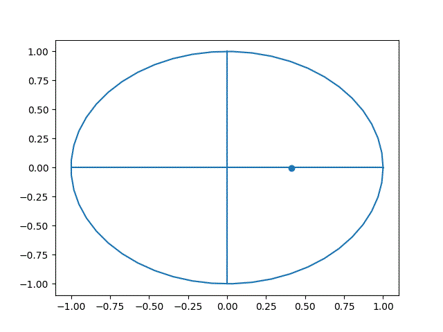
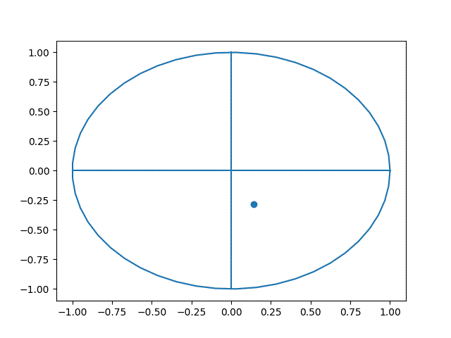

# ECE443 - Beamtracking Project

This is a project for ECE 443: Analog and Digital Communications to model beamtracking systems in wireless communications.
Based on a paper that can be found [here](https://arxiv.org/abs/2001.06595).

## Dependencies

- [Python 3.x](https://www.python.org/downloads/)
- numpy
- scipy
- matplotlib
- imageio

## Python Virtual Environment

Before running the python scripts, install the virtual environment using these steps in a terminal from the root of the repo:

```cmd
cd scripts
create_venv.bat
```

## Running the Simulation

There is a script for each beam search method.

```cmd
cd src
python exhaustive.py
```

or

```
python contiguous.py
```

```
python non-contiguous.py
```

### Other Scripts

- playground.py
    - Produces animations of each beam in the search algorithms as a plot and a gif in `./output/`.
    - Uncomment the desired functions in `if __name__ == "__main__"` block to produce the desired animation.
- algorithm_comp.py
    - Plots a comparison of each of the search algorithms.

## Examples

### Exhaustive Search - Single User


### Contiguous Beams - Single User


### Non-Contiguous Beams - Single user





### Exhaustive Search - Multi User


