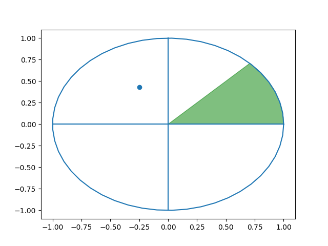
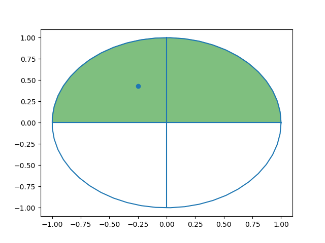
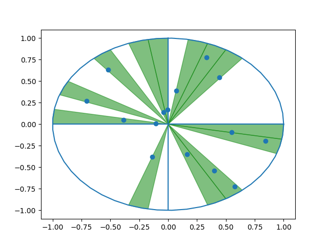
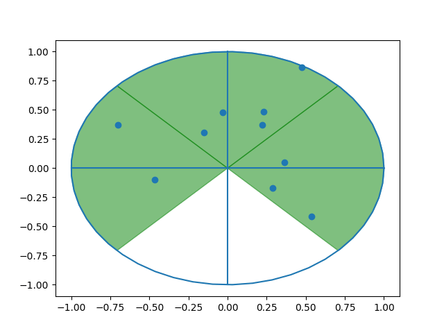
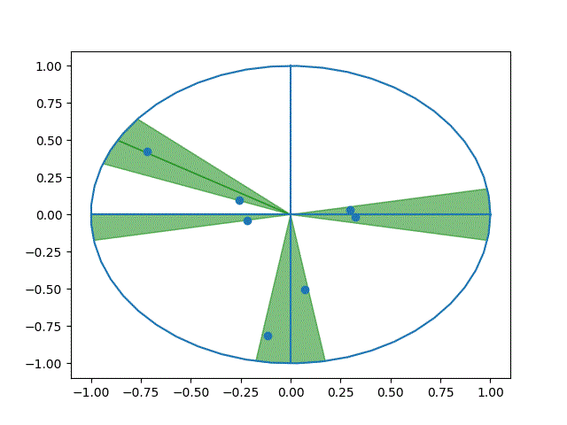

# ECE443 - Beamtracking Project

This is a project for ECE 443: Analog and Digital Communications to model beamtracking systems in wireless communications.

## Dependencies

- [Python 3.x](https://www.python.org/downloads/)

## Python Virtual Environment

Before running the python scripts, install the virtual environment using these steps in a terminal from the root of the repo:

```cmd
cd scripts
create_venv.bat
```

## Running the Simulation

There is a script for each beam search method.

```cmd
cd src
python exhaustive.py
```

or

```
python upper_bound.py
```

## Examples

### Exhaustive Search - Single User



### Contiguous Beams - Single User





### Exhaustive Search - Multi User




